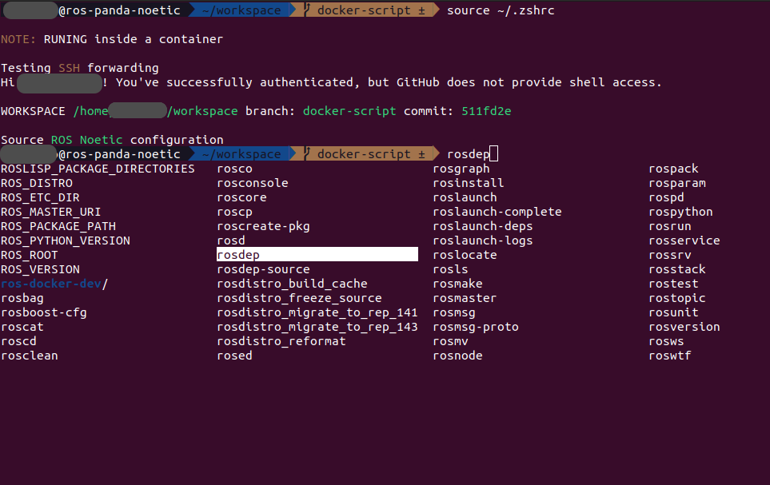

# Editable ROS Docker Development

<!-- You could also check the latest [main branch README.md](https://github.com/AlfredMoore/ros-docker-dev/blob/main/README.md) -->

## Prerequisites
You should firstly install [Docker Engine](https://docs.docker.com/engine/install/ubuntu/) on your Ubuntu. Then [manage docker as a non-root user](https://docs.docker.com/engine/install/linux-postinstall/#manage-docker-as-a-non-root-user), to enable `docker` instead of `sudo docker`.

 * NOTE: Do not install Docker Desktop. It is different from the Docker Engine and not so friendly to docker development.

## ROS Noetic for Franka Panda
To Create an Image, Run the Container or Open another section in Container, please `cd ros-docker-dev` to enter the dir then run the scripts. 
```bash
./enterpoint.sh
```
### Options
 * -n: Nocache or rebuild New image
 * -b: use Bash instead of zsh
 * -r: enable Realtime kernel

### Rebuild or Build with no cache
If you want to rebuild the image with changed dockerfile or to build with no-cache for the latest dependencies, you could build with no cache by running the following scirpts. In this way, you could rebuild the image from scratch but spend much longer time.
```bash
./enterpoint.sh -c
```

## Features:
 * Volumed: Container volumed the parent folder(../ros-docker-dev) as the workspace in container. If you don't need it, please comment in the [enterpoint.sh](./enterpoint.sh)
 ```bash
 --volume="$(dirname ${ENTERPOINT_DIR}):${WORKSPACE_PATH}"   # Volume the parent of this docker repo to workspace
 ``` 
 * User spoofing: Container has the same username and password as the host.
 * SSH forwarding: Container fetches the same ssh agent as the host (if you have set the ssh-agent in host). No need to add any additional SSH key pair. In the container you could directly use `git` via SSH.

 ## Notes:
 * Oh-my-zsh: Container has an configured oh-my-zsh. It is editable in the [configs/oh-my-zsh.zshrc](./configs/oh-my-zsh.zshrc).
 * Editable and Readable: [Dockerfile](./panda-noetic.Dockerfile), [Building Config](./panda-bake.hcl) and [Running Config](./enterpoint.sh). You can also build from the [raw dockerfile](./raw.Dockerfile).

## Contribution
### [NIST_Benchmark](https://github.com/Wisc-HCI/NIST_Benchmark)
:warning: **Note: In the container, you can use zsh intead of bash. `zsh` is pretty and more powerful with oh-my-zsh theme and auto-completion. But remember to `source /devel/setup.zsh` instead of `.bash`**

 * Some computers support directly `sudo apt install libfranka`, but some do not. So uncomment `RUN apt-get ...` in [panda-noetic.Dockerfile](./panda-noetic.Dockerfile) if it is possible, or you should build from source following [this](https://frankaemika.github.io/docs/installation_linux.html#building-from-source).
   ```Dockerfile
   # Install libfranka and franka-ros
   USER root
   ## Uncomment the following lines if you can apt install libfranka
   RUN apt-get update && apt-get install --yes \
       ros-noetic-libfranka ros-noetic-franka-ros
   ```
 * Change your docker image name and container name in [env.sh](./env.sh)
   ```bash
   # Image Tag and Container Name
   export IMAGE_TAG="WiscHCI/panda-ros:${GIT_LABEL}"
   export CONTAINER_NAME="ros-panda-noetic"
   ```

## e.g.


## TODO ~~(TBD: lazy man)~~
Update to docker compose run and build (docker compose documents are unclear).
